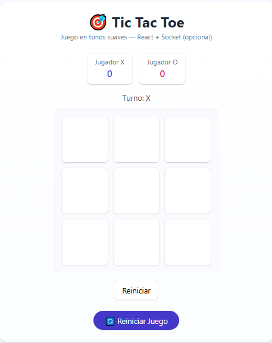
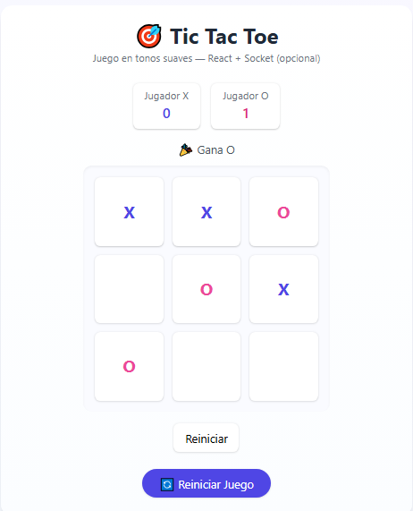
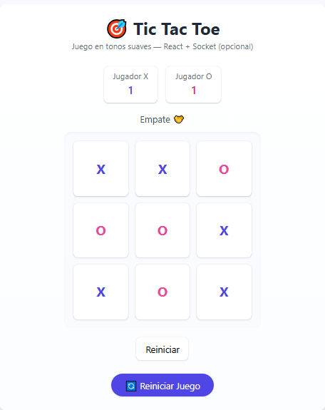

# 🎮 Tic Tac Toe - Juego a modo de Práctica

Un proyecto **full-stack moderno** del clásico juego **Tic Tac Toe (Ta-Te-Ti)**, desarrollado con **React + Vite** en el frontend y **Node.js + Express** en el backend.  
Presenta un diseño minimalista, colores suaves, animaciones elegantes y una arquitectura organizada y eficiente.

---

## 🚀 Características principales

✅ Interfaz moderna y responsiva con tonos pastel  
✅ Animaciones suaves y experiencia de usuario fluida  
✅ Lógica de juego clara, eficiente y bien documentada  
✅ Arquitectura escalable (frontend + backend separados)  
✅ Backend con Node.js/Express (API REST simple)  
✅ Frontend optimizado con React y Vite  
✅ Código organizado, limpio y comentado  

---

## 🧩 Tecnologías utilizadas

**Frontend**
- React 18  
- Vite  
- TailwindCSS  
- Framer Motion (animaciones)  
- Axios  

**Backend**
- Node.js  
- Express  
- CORS  
- Nodemon (modo desarrollo)  

---

## 🏗️ Estructura del proyecto

Proyecto-Juegotictactoe/
├── backend/
│ ├── index.js
│ ├── package.json
│ └── ...
│
└── frontend/
├── src/
│ ├── components/
│ ├── assets/
│ ├── App.jsx
│ └── main.jsx
├── package.json
├── vite.config.mjs
└── ...

yaml
Copiar código

---

## ⚙️ Instalación y ejecución local

### 🔹 Clonar el repositorio
```bash
git clone https://github.com/MairaAndrada71/Proyecto-Juegotictactoe.git
cd Proyecto-Juegotictactoe
🔹 Instalar dependencias y ejecutar el backend
bash
Copiar código
cd backend
npm install
npm run dev
📡 Servidor en ejecución en: http://localhost:4000

🔹 Instalar dependencias y ejecutar el frontend
En una nueva terminal:

bash
Copiar código
cd frontend
npm install
npm run dev
🌐 Abrí la app en: http://localhost:5173

🎨 Estilo y diseño
El diseño está inspirado en tonos suaves y modernos, con tipografía minimalista y animaciones de transición sutiles.
Se utilizó TailwindCSS para una maquetación responsiva y Framer Motion para las animaciones.

🪄 El resultado: una interfaz atractiva, profesional y agradable de usar.

🧠 Aprendizajes clave
Este proyecto refuerza habilidades en:

Comunicación entre frontend y backend

Gestión de estado y hooks en React

Manejo del ciclo de vida de componentes

Buenas prácticas de arquitectura y nombrado

Deploy profesional (Vercel + Render)

💡 Posibles mejoras futuras
✨ Modo multijugador online con Socket.io
✨ Marcador global y estadísticas
✨ Selector de tema (claro / oscuro)
✨ Integración con base de datos (MongoDB)
✨ IA básica como oponente

## 📸 Vista previa
<p align="center">
### 🏁 Pantalla principal


### 🏆 Jugador ganador


### 🤝 Empate

</p>


👩‍💻 Autora
Maira Natalia Andrada
Desarrolladora Full Stack

📧 mairaandrada@gmail.com
💼 LinkedIn
(https://www.linkedin.com/in/maira-natalia-andrada-01a8701b7/)

🪶 Licencia
Este proyecto está bajo la licencia MIT.
Podés usarlo, modificarlo y compartirlo libremente con fines educativos o profesionales.